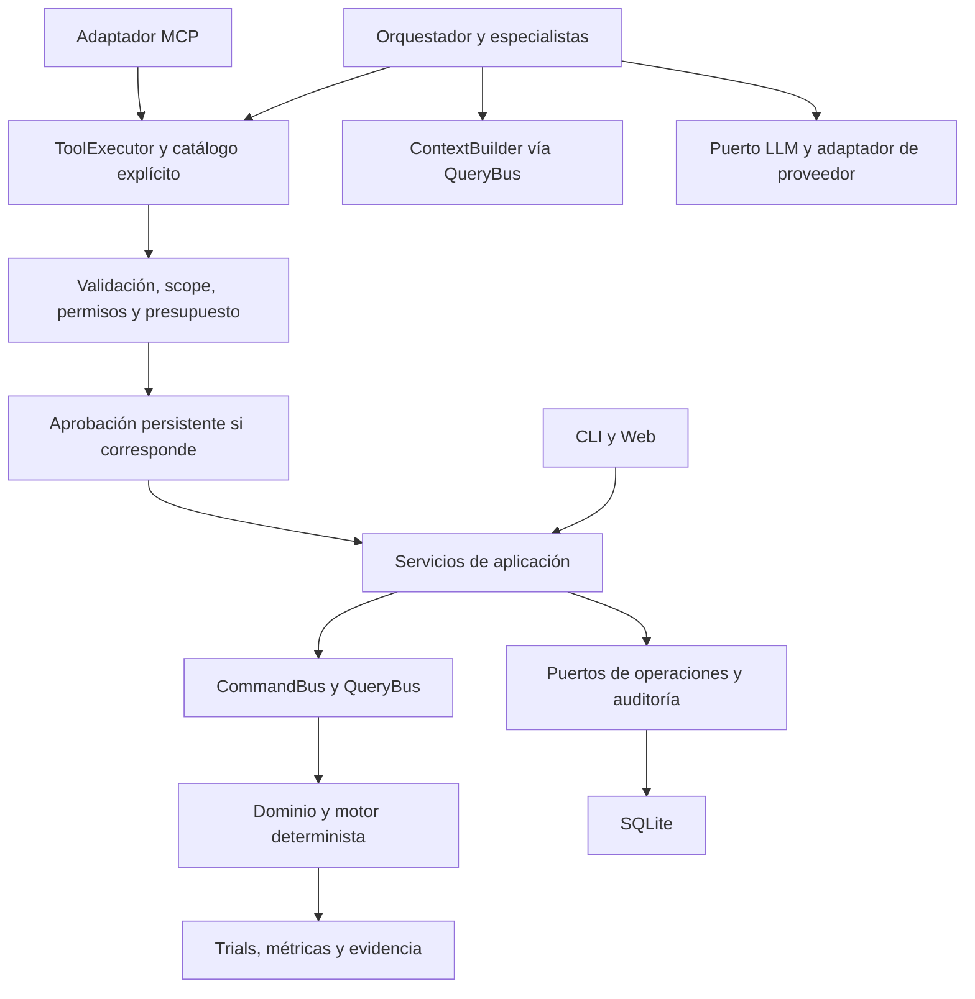

# Plan de implementación: herramientas, MCP y agentes de experimentación

> Estado: diseño propuesto; estas capacidades deben implementarse y verificarse.
> Revisión: 2026-09-30. Alcance: V0.9 y V1.0, con reparto para dos desarrolladores después de acordar contratos.
> Referencias: [arquitectura](../../../ARCHITECTURE.md), [arquitectura técnica](../../../AutoML_Arquitectura_Tecnica.md), [guía](../../../DEVELOPER_GUIDE.md), [CQRS](../../decisions/001-hexagonal-architecture-and-cqrs.md) y [experimentación](../../decisions/002-hypothesis-driven-experiments.md).

**Entrada para colaboradores:** empieza por [README.md](README.md) para elegir Persona A o B y seguir el orden de lectura; continúa con este diseño y el [reparto operativo](two-person-plan.md).

## 1. Objetivo y alcance

Permitir que un cliente MCP o un agente consulte CATML, proponga experimentos y ejecute capacidades autorizadas mediante los mismos buses que CLI y Web. La ejecución, las métricas y la promoción permanecen en el motor determinista.

V0.8 queda pospuesta. El contexto inicial usa perfiles, evidencia e histórico del run actual, sin asumir similitud de datasets ni warm-start. La arquitectura técnica conserva el orden original; H0 debe registrar un ADR que explique la reordenación y sus límites para V1.0.

El primer alcance es tabular y opera sobre un run existente. Crear runs desde archivos requiere inventariar esa capacidad y exponerla en aplicación si no existe un Command adecuado. DAG multimodal, inferencia, submissions, acceso remoto y ejecución distribuida quedan para incrementos posteriores. OOF es una tarea independiente; su ausencia no bloquea las tools de consulta ni se presenta como capacidad disponible.

Decisiones que se cierran en H0: catálogo/schemas versionados, versiones compatibles con el Python soportado, modelo transaccional de operaciones, límites predeterminados, aprobación/cancelación y propietarios de archivos compartidos. Este documento establece requisitos; los defaults numéricos y firmas finales requieren esa revisión antes de programar consumidores.

## 2. Módulos y dependencias

| Módulo | Responsabilidad | Dependencias |
| --- | --- | --- |
| `domain/agents/` | Valores y reglas puras de permisos, límites y aprobación | Dominio y biblioteca estándar |
| `application/agents/` | Catálogo, schemas, executor, políticas aplicadas, DTOs y contexto | Dominio, buses y puertos inyectados |
| `agents/` | Especialistas y adaptación opcional de LangGraph | Contratos/servicios de aplicación |
| `interfaces/mcp/` | Lifecycle MCP, tools/resources y transporte | Servicios de aplicación y SDK MCP opcional |
| CLI/Web | Inicio, estado, aprobación y controles humanos | Commands, Queries y fachada de aplicación |
| `infrastructure/` | SQLite, auditoría, operaciones, checkpoints y proveedor LLM | Implementa puertos; contiene SDKs externos |

`AgentTool`, schemas y contratos del proveedor pertenecen a aplicación. `domain/` y `engine/` no importan MCP, LangChain, LangGraph, Pydantic ni SDKs LLM. Los tipos del grafo no aparecen en Commands/Queries públicos. Agentes e interfaces no acceden directamente al repositorio ni al entrenamiento.

Revisar `domain/ports.py` antes de añadir abstracciones; reutilizar `ExperimentRepositoryPort`, `ExperimentPlannerPort`, `FeatureEvidenceRepositoryPort` y `BudgetPolicy` cuando corresponda. Puertos técnicos exclusivos de aplicación se definen en `application/agents/ports.py`.

Nuevos Commands/Queries se registran en `application/bootstrap.py`. La composición opcional reside en `application/agents/bootstrap.py`, invocada explícitamente desde el punto de entrada; el bootstrap base debe importarse sin extras.



MCP y LangGraph son adaptadores intercambiables. El agente local usa servicios de aplicación sin necesitar un servidor MCP.

## 3. Contratos compartidos y schemas

Nombres propuestos: H0 fija firmas y ejemplos serializados. Los tests de contrato funcionan sin SDKs ni credenciales.

| Contrato | Contenido mínimo |
| --- | --- |
| `ToolDefinition` | Nombre/versión, descripción, schemas de entrada/salida, Command/Query asociado, efecto, permiso y estimación de coste |
| `ToolCallContext` | Actor confiable, workspace/run autorizado, request/correlation ID y deadline; construido por la interfaz, nunca por el LLM |
| `ToolInvocation` | Tool/versión, argumentos y clave de idempotencia para mutaciones |
| `ToolResult` | Request ID, estado, DTO serializable/error; operation ID para trabajos largos y approval ID cuando corresponda |
| `ToolError` | Código estable, mensaje público, detalles seguros, posibilidad de reintento y correlation ID |
| `PolicyDecision` | Allow/deny/require approval, motivo, límites efectivos y versión de política |
| `ApprovalRequest` | Actor, run, acción/argumentos normalizados, hash, coste máximo, vencimiento, estado y revisor |
| `OperationRecord` | ID, run, actor, clave de idempotencia, hash de argumentos, estado, reserva/consumo y resultados referenciados |
| `Hypothesis` | ID, run, razón, configuración candidata, baseline, métrica/dirección y criterio de verificación |
| `AgentContext` | Perfil resumido, modelos compatibles, evidencia con IDs, resultados comparables, límites y omisiones |
| `AgentSessionState` | Versión, session/run IDs, objetivo tipado, hipótesis, operación pendiente, presupuesto, checkpoint y motivo de parada |

Commands retornan IDs o confirmaciones; wrappers normalizan retornos heredados sin filtrar entidades/repositorios. Queries conservan cero mutaciones: consultar no crea perfiles ni entrena. La telemetría de la invocación se registra fuera del handler de consulta.

Validar campos desconocidos, enums, valores no finitos, tamaños, pertenencia de IDs y tipos con schema explícito. La introspección ayuda, pero no publica automáticamente todos los Commands. `Any`, DAGs o estrategias complejas requieren DTO específico antes de exponerse. Versionar schemas y comprobar compatibilidad de consumidores; cambios incompatibles requieren nueva versión.

Errores iniciales: `INVALID_ARGUMENT`, `NOT_FOUND`, `SCOPE_VIOLATION`, `PERMISSION_DENIED`, `BUDGET_EXCEEDED`, `APPROVAL_REQUIRED`, `CONFLICT`, `DEADLINE_EXCEEDED`, `DEPENDENCY_UNAVAILABLE`, `INTERNAL_ERROR`. MCP distingue errores de protocolo y de ejecución conforme a la versión negociada.

## 4. Catálogo inicial y ejecución

| Tool propuesta | Capacidad existente | Hito |
| --- | --- | --- |
| `get_dataset_profile` | `GetDatasetProfileQuery` | H1 |
| `list_models`, `list_plugins` | Queries homónimas | H1 |
| `list_experiments`, `get_leaderboard` | Queries homónimas | H1 |
| `get_feature_evidence`, `get_feature_ranking` | Queries homónimas | H1 |
| `create_experiment` | `CreateExperimentCommand` | H2 |
| `prioritize_feature` | `PrioritizeFeatureCommand` | H2 |
| `run_experiment` | `RunExperimentCommand` | H2 |
| `optimize_experiment` | `OptimizeExperimentCommand` | H3 |

Ruta común: resolver tool → validar argumentos → verificar actor/scope → evaluar política → resolver aprobación → reservar presupuesto/operación → dispatch al bus → normalizar resultado → registrar desenlace → conciliar reserva.

Los permisos del agente restringen el catálogo, sin duplicar reglas de entrenamiento. No hay `eval`, `exec`, shell, SQL libre, descarga arbitraria ni generación de código ejecutable.

Aprobar permite ejecutar; aceptar una mejora exige evidencia registrada y comparación con baseline. La promoción usa la capacidad existente y no forma parte del catálogo automático inicial. Crear una propuesta no entrena ni la promueve.

## 5. Presupuestos y aprobación

### Límites estrictos

Separar límites del agente de filtros heurísticos del planner. `BudgetPolicy` permite excepciones para candidatos fijados y evalúa modelos a nivel de candidato; no basta como frontera de autorización. El executor verifica cada modelo y reserva el coste máximo permitido, incluso si la propuesta está fijada.

Contabilizar experimentos, trials/HPO, fits estimados por folds, duración total, llamadas LLM y tokens. Coste monetario solo con datos fiables del proveedor; consumo desconocido no equivale a cero. Reservas atómicas impiden que solicitudes concurrentes gasten el mismo saldo. Tras caída, reconciliar antes de admitir otra mutación.

Timeout del cliente no implica entrenamiento terminado. Pausa/cancelación inicial es cooperativa entre unidades de trabajo, sin prometer interrumpir un `fit` ya iniciado. No comienzan nuevos trials después de observar cancelación o agotar límites. Registrar consumo de operaciones fallidas y canceladas.

### Política única y aprobación persistente

Una regla pura decide allow/deny/require approval; CLI, Web, MCP y LangGraph presentan o consumen esa decisión. Evitar políticas de aprobación duplicadas en el grafo y en tools.

Modos: `read_only`, `propose_only`, `execute_within_budget`. H0 fija defaults finitos. Lecturas autorizadas no necesitan aprobación; ejecutar usa la autorización previa dentro de su scope/presupuesto. Ampliar alcance o coste genera solicitud concreta con argumentos y estimación.

Aprobación ligada a hash de acción, actor, run, argumentos, política y coste máximo. Cambios, vencimiento o revocación obligan a reevaluar. El agente no aprueba sus solicitudes. En modo no interactivo devolver pending e ID; no esperar entrada de terminal ni asumir aprobación por timeout.

## 6. Scope, contexto y evidencia

Validar relaciones workspace/run/dataset/experiment/trial antes de leer o ejecutar, además de formato de IDs. Verificar el caso del blackboard #14 (predicción con experimento de otro run) antes de habilitar inferencia por tools; esta capacidad queda fuera del primer catálogo.

Texto de datasets y del LLM son entradas no confiables. Enviar agregados y evidencia referenciada, sin filas completas, secretos ni rutas sensibles por defecto. Nombres de columnas no alteran políticas. Propuestas deben referenciar features reales, modelos compatibles y métricas admitidas. Probar instrucciones adversarias incrustadas en el contexto.

`AgentContextBuilder` consulta QueryBus, omite datos no disponibles y aplica límite configurable. 1500 tokens es un objetivo inicial: usar contador del proveedor o estimación explícita, registrar truncamiento y reservar espacio de salida. Historial completo queda persistido; el contexto lleva resúmenes con IDs.

Comparar solo resultados con métrica/dirección, dataset, split, folds y baseline compatibles. Persistir seed, configuración, versiones de schema/prompt/proveedor y referencias de trials. Si falta metadata, informar que la comparación no puede sostenerse. Reproducibilidad de ejecución no implica respuestas LLM idénticas.

## 7. Operaciones, auditoría y recuperación

Separar eventos de negocio existentes, historial de acciones y registro recuperable de operaciones/aprobaciones. Reutilizar repositorio/migraciones cuando cubran la semántica requerida; crear tablas nuevas solo cuando sea necesario.

- Auditoría append-only desde aplicación: actor, tool/versión, argumentos redactados o hash, decisión, tiempos, correlation ID, operación y resultados. No se afirma resistencia criptográfica a manipulación de SQLite.
- Intención duradera antes de mutar: si falla, no ejecutar. Si falla registrar desenlace después del efecto, pasar a recuperación y consultar evidencia; no repetir a ciegas.
- Clave de idempotencia única por workspace/actor/tool. Misma clave/argumentos devuelve operación o resultado existente; argumentos distintos producen `CONFLICT`.
- Ledger y efecto comparten transacción cuando sea posible. Si no, H0 define reconciliación con IDs estables/eventos. Efecto indeterminado produce `recovery_required` y bloquea repetición automática.
- Checkpoint del grafo no garantiza ejecución única de Commands. Probar caída tras efecto y antes de checkpoint; no prometer «exactly once» sin garantías del núcleo.
- Reintentos limitados con backoff para lecturas/proveedor en errores transitorios. Mutaciones requieren idempotencia/reconciliación. Permisos, validación y presupuesto no se reintentan.
- Trabajos largos retornan operation ID. Consultar estado por Query y controlar por Commands registrados. Worker usa buses/servicios; inicialmente un escritor por run con lease durable y recuperación de lease vencido.
- Migraciones idempotentes y prueba de workspace anterior/reapertura. Checkpoint de entrenamiento y checkpoint de agente son diferentes.

Estados de operación: queued, running, succeeded, failed, cancel_requested, cancelled, recovery_required. Aprobación: pending, approved, rejected, expired, revoked. Definir transiciones y actores permitidos; replay no reabre estados terminales.

## 8. MCP como adaptador

H1 implementa stdio, negociación de versión/capacidades, listado/invocación de tools y resources de lectura con SDK oficial. Stdout queda reservado al protocolo; logs van a stderr.

Resources: `catml://runs/{run_id}/leaderboard`, `catml://datasets/{dataset_id}/profile`. Resuelven Queries con scope y tamaño limitado, paginación/truncamiento explícito. No exponen SQLite/archivos arbitrarios ni generan perfiles al leer.

Streamable HTTP se añade en H3 con autenticación, autorización, validación de Origin, sesiones y aislamiento entre clientes; localhost por defecto. HTTP+SSE antiguo solo si un cliente identificado requiere compatibilidad. Esta elección sigue la [especificación MCP de transportes 2025-11-25](https://modelcontextprotocol.io/specification/2025-11-25/basic/transports). H0 registra versión de protocolo/SDK elegida y comprueba su lifecycle antes de implementar.

## 9. V1.0: especialistas y flujo recuperable

Primero construir ciclo determinista con proveedor falso; LangGraph adapta el flujo una vez verificadas tools y recuperación.

Flujo: Observe → Propose → Validate → Authorize → Execute → Evaluate → Stop/Observe. Compatibilidad, scope y evidencia se validan de forma determinista. Approval pendiente conserva estado, sin mutaciones antes de resolverla.

- Planner produce hipótesis/configuración candidata; no ejecuta tools mutantes.
- Feature Advisor propone cambios y sospechas de leakage con referencias; requieren verificación.
- Critic interpreta métricas existentes; informa varianza/overfitting solo cuando hay evidencia suficiente.
- Orchestrator aplica transiciones, ejecuta tools y persiste estado. Proveedor LLM inyectado por puerto; SDK/secretos en infraestructura.

Paradas: presupuesto agotado, objetivo verificado, máximo de iteraciones, cancelación, ausencia de candidatos nuevos, hipótesis normalizada repetida o falta de mejora durante paciencia configurada. Mejoras requieren evidencia comparable, no solo texto del Critic.

Checkpoint duradero con session/thread ID estable y estado versionado. Reanudar reconcilia operaciones en vuelo y revisa políticas/aprobaciones. Las [interrupciones de LangGraph](https://docs.langchain.com/oss/python/langgraph/interrupts) pueden reejecutar código del nodo; aislar/deduplicar efectos en aplicación. Su [persistencia](https://docs.langchain.com/oss/python/langgraph/persistence) complementa el ledger de CATML.

CLI propuesta: `automl agent run --run-id ID --goal "mejorar ROC-AUC"`, convirtiendo objetivo a estructura validada. Estado, aprobación, pausa, reanudación y cancelación usan la capa de aplicación; estas interfaces todavía no están disponibles.

## 10. Hitos y reparto para dos desarrolladores

El reparto operativo se detalla en [two-person-plan.md](two-person-plan.md): paquetes A0–A5/B0–B5, dependencias, entregables, propiedad de tests/archivos, revisión cruzada y orden de integración. Esta sección resume el diseño; el documento complementario concreta la ejecución entre dos personas.

La división reduce conflictos; no garantiza cero conflictos. No programar adaptadores paralelos sin contratos H0.

| Hito | Entregable y aceptación | Dev A | Dev B | Dependencia |
| --- | --- | --- | --- | --- |
| H0 | ADR, contratos/schemas, defaults y modelo transaccional con tests de contrato | Políticas/executor/persistencia propuesta | Revisar MCP/proveedor y fixtures de consumidores | Revisión conjunta |
| H1 | Consultas por buses, cliente MCP real stdio e import base sin extras | Catálogo, DTOs y scope | MCP y prueba subprocess | H0 |
| H2 | Crear → aprobar → ejecutar → consultar; idempotencia/recuperación | Executor, presupuestos, aprobación, ledger/auditoría | Tools mutantes MCP, CLI y E2E | H1 |
| H3 | HPO/trabajos largos y cancelación; HTTP si entra en alcance | Worker/leases/reconciliación | HTTP y control humano | H2 |
| H4 | Ciclo con proveedor falso, contexto, evidencia y paradas | Contexto/especialistas | Máquina de estados y CLI de sesión | H2; H3 para trabajos largos |
| H5 | LangGraph, checkpoint duradero y proveedor opcional | Adaptador LLM/evaluaciones | Grafo/recuperación/E2E | H3 y H4 |

Propiedad propuesta:

| Propietario | Rutas |
| --- | --- |
| A | `domain/agents/`, `application/agents/{contracts,ports,registry,executor,context_builder}.py`, políticas/operaciones, persistencia agéntica, `agents/specialists/`, adaptador LLM |
| B | `interfaces/mcp/`, `agents/{state,orchestrator}.py`, `interfaces/cli/{mcp_cli,agent_cli}.py`, tests de transporte/orquestación |
| A con revisión B | `application/bootstrap.py`, `application/agents/bootstrap.py`, `domain/ports.py` si procede y migraciones existentes |
| B con revisión A | `interfaces/cli/main.py`, `pyproject.toml`, CI |
| B con revisión A | TASKS, progreso y documentación al cerrar cada hito; B redacta ADR de alcance/dependencias con revisión A |

Ramas por paquete A0–B5 según `two-person-plan.md`, con commit base común y worktrees separados. Integrar por hito con tests de contrato; stubs no sustituyen pruebas contra implementación real. Cambios de contrato requieren revisar ambos consumidores.

## 11. Dependencias y compatibilidad

Extras separados propuestos: `mcp` para SDK/servidor; `agents` para LangGraph/checkpoint duradero; proveedor opcional cuando se seleccione. Agente local no requiere MCP. LangChain completo/Pydantic solo si una función concreta los necesita, fuera del núcleo.

H0 verifica versiones mantenidas compatibles entre sí y con Python/plataformas CI, documentando conjunto resuelto reproducible. No copiar límites antiguos como `mcp>=1.0`, `langgraph>=0.1` como garantía de compatibilidad ni elevar silenciosamente Python mínimo del motor por un extra.

Imports opcionales en puntos de entrada, con instrucción clara de instalación si falta un extra. CI prueba base, base+MCP y base+agentes; tests opcionales se ejecutan en sus jobs, no quedan todos omitidos. Núcleo y CLI base funcionan sin proveedor/credenciales.

## 12. Pruebas y aceptación

Fixtures locales, SQLite temporal y proveedor determinista; sin credenciales/red de proveedor en CI. Probar comportamiento y contratos, evitando asserts sobre frases exactas del LLM.

| Área | Casos obligatorios |
| --- | --- |
| Arquitectura | Imports prohibidos, bootstrap/CLI sin extras, nuevos Commands/Queries registrados |
| Contratos | Schemas, serialización/errores, campos extra, `Any` sin DTO, valores no finitos |
| Scope/permisos | IDs de otro run/workspace, tools desconocidas, modo lectura y modelos parcialmente prohibidos |
| Presupuesto | Límite exacto, candidato fijado, HPO/folds, reservas concurrentes y caída/conciliación |
| Aprobación | Pending no interactivo, vencimiento, argumentos/política cambiados, rechazo/revocación/replay |
| CQRS | Lectura sin mutación, candidato sin entrenamiento, promoción con evidencia |
| Recuperación | Duplicados, misma clave con otro payload, caída antes/después del efecto, fallo de auditoría, lease vencido |
| MCP | Lifecycle, stdio subprocess, stdout limpio, tools/resources/errores con cliente real; HTTP aislado si se habilita |
| Agente | Output inválido, contexto adversario/truncado, proveedor caído, hipótesis repetidas, presupuesto, pausa/reinicio/cancelación |
| Compatibilidad | Workspace antiguo tras migración, estado/checkpoint versionados y matriz de extras |
| E2E | Perfil → candidato → aprobación → ejecución → métrica → Critic → parada; reinicio sin repetir entrenamiento |

Desde raíz:

```bash
.venv/bin/pytest -ra --cov=src/automl --cov-fail-under=85
.venv/bin/automl --help
.venv/bin/automl task list
```

Ejecutar toda la suite, no limitarse al conteo histórico de 146 tests. Cobertura global >=85% y >=85% de cada conjunto nuevo de módulos; detallar exclusiones legítimas. Medir baseline antes de implementar: incumplimientos previos se registran y su corrección se acuerda por separado, sin declararlos resueltos.

Cierre por hito: tests del incremento/suite completa, cobertura acreditada, ejemplos reproducibles, errores documentados, TASKS/progreso y revisión de integración. Terminar este documento no completa un hito de implementación.

## 13. Primer flujo revisable y salida

Con run fixture y baseline: consultar perfil/modelos → crear hipótesis candidata → mostrar decisión/coste → ejecutar una vez → consultar métrica → comparar evidencia compatible → terminar con motivo registrado. Repetir solicitud/reiniciar en puntos de fallo no crea otro experimento/trial.

- [ ] H0: contratos, ADR, defaults y recuperación acordados.
- [ ] H1: consultas y stdio verificables sin proveedor LLM.
- [ ] H2: mutaciones autorizadas, límites, auditoría e idempotencia probadas.
- [ ] H3: trabajos largos recuperables y HTTP validado si entra en alcance.
- [ ] H4: especialistas/ciclo con proveedor falso y paradas deterministas.
- [ ] H5: LangGraph opcional, checkpoints y pruebas de reinicio.
- [ ] Suite/cobertura requeridas y documentación sincronizada.
- [ ] Núcleo utilizable sin extras ni credenciales.

Riesgos por resolver: atomicidad ledger/repositorio (H0/H2), cancelación durante entrenamiento (H3), metadata insuficiente para comparar (H4), compatibilidad SDK/Python (H0/H1/H5) y deriva de schemas (todos los hitos). Cada uno tiene prueba/criterio asociado. No se promete ejecución distribuida ni recuperación automática cuando el efecto de una operación sea indeterminado.
