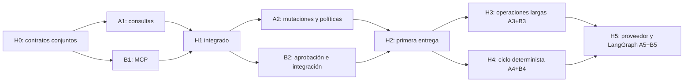

# Ejecución del sistema agéntico entre dos personas

> Estado: planificación; ninguna tarea de implementación se completa con este documento.
> Complementa [plan.md](plan.md): conserva su alcance, límites arquitectónicos y aceptación H0–H5.
> Personas A y B son roles; se pueden asignar a los dos colaboradores sin cambiar los contratos.

**Si acabas de llegar, lee primero [README.md](README.md):** explica cómo escoger A/B, el orden de lectura y la primera entrega A0 o B0. Este documento contiene el reparto completo una vez elegido el rol.

## 1. Responsabilidades y primera entrega

**Persona A — Aplicación, políticas y evidencia.** Implementa contratos, herramientas, presupuestos, auditoría, operaciones recuperables y especialistas. Es responsable de que las acciones sean válidas y verificables mediante el núcleo CATML.

**Persona B — Interfaces, integración y orquestación.** Implementa MCP, CLI, matriz CI y el ciclo del agente/LangGraph. Es responsable de que consumidores reales usen esos contratos y sobrevivan a interrupciones sin repetir acciones.

La primera entrega conjunta es V0.9 local: consultar un run existente, crear un candidato, resolver autorización, ejecutar una vez y consultar métricas desde MCP stdio. Después se añaden trabajos largos y V1.0. HTTP remoto, DAG multimodal, inferencia y submissions no entran en esa primera entrega.

## 2. Paquetes de trabajo con dependencias

Cada fila es un PR revisable; si supera una revisión manejable, dividir dentro del mismo paquete preservando su aceptación. La otra persona revisa el PR. Un consumidor puede usar fixtures acordadas mientras espera la implementación, pero su hito solo cierra con integración real.

| ID / hito | Responsable | Trabajo y entregable | Depende de | Aceptación específica |
| --- | --- | --- | --- | --- |
| A0 / H0 | A | Contratos de tools/DTOs/errores, puertos, schemas de ejemplo, política/defaults finitos y propuesta transaccional | Inicio | Tests de contrato sin extras; inputs/outputs válidos e inválidos; ledger/efecto y recuperación definidos |
| B0 / H0 | B | Matriz SDK/Python, fixtures de consumidor, prueba de viabilidad stdio/checkpointer y ADR de alcance/dependencias | Inicio; revisa A0 | Consumidores aceptan contratos; incompatibilidades documentadas; pruebas sin credenciales |
| A1 / H1 | A | Catálogo de consultas, normalización de DTOs, validación y pertenencia de IDs | H0 integrado | Consultas por QueryBus sin mutaciones, errores tipados y tamaño limitado |
| B1 / H1 | B | MCP stdio, tools/resources de consulta, `automl mcp`, extra MCP y job CI | H0 integrado; A1 para cierre | Cliente SDK real/subprocess, lifecycle y stdout limpio; CLI base sin extra |
| A2 / H2 | A | Tools mutantes, límites estrictos, aprobación, ledger/auditoría y deduplicación | H1 integrado | Duplicados no repiten efectos, scope/modelos denegados, caída/auditoría probadas |
| B2 / H2 | B | Adaptación de resultados mutantes MCP, CLI de aprobación/estado y flujo E2E | H1; contratos A2; A2 para cierre | Pending no bloquea terminal; candidato no entrena; ejecución autorizada una vez y métricas consultables |
| A3 / H3 | A | HPO, worker, reservas, leases por run, reconciliación y cancelación cooperativa | H2 integrado | Solicitudes concurrentes no exceden límites; reinicio concilia; no comienza otro trial tras cancelación observada |
| B3 / H3 | B | Estado/control de operaciones desde CLI/MCP y tests E2E de reinicio; HTTP solo si se acuerda | H2; contratos A3; A3 para cierre | Timeout no se presenta como cancelación; operation ID recuperable; HTTP aislado si entra en alcance |
| A4 / H4 | A | ContextBuilder, Planner/Advisor/Critic, proveedor falso y evidencia comparable | H2; contratos V1.0 revisados | Contexto acotado, output inválido rechazado, ausencia de metadata explícita y propuestas sin efectos |
| B4 / H4 | B | Máquina de estados determinista, CLI de sesión y criterios de parada | H2; contratos V1.0; A4 para cierre | Ciclo completo con proveedor falso; presupuesto, hipótesis repetida, pausa y aprobación persistente |
| A5 / H5 | A | Adaptador LLM opcional, validación de respuestas y evaluaciones de especialistas | H4; proveedor seleccionado | Tests sin red, timeout/reintentos acotados, datos redactados y metadatos de proveedor registrados |
| B5 / H5 | B | LangGraph/checkpointer, reanudación, extra agents y matriz CI final | H3 y H4; A5 para proveedor real | Caída después de efecto no repite Command; sesión/aprobación sobrevive a reinicio; instalación base intacta |

H0 incluye una revisión conjunta de A0/B0 antes de fusionar ambos. B puede preparar transporte y tests de consumidor durante A1/A2/A3; esos paquetes no se consideran completos con stubs.

A3/B3 y A4/B4 pueden alternarse después de H2 si los contratos de operación y sesión están estables. No abrir cuatro tareas simultáneas con solo dos personas: cada persona mantiene un paquete principal, y aprovecha esperas de revisión para preparar el siguiente. H5 empieza después de integrar H3 y H4.

## 3. Orden de ejecución y puntos de integración

| Iteración | Persona A | Persona B | Entrega conjunta / condición de avance |
| --- | --- | --- | --- |
| 0 | A0: contratos, política y persistencia | B0: consumidores, compatibilidad y ADR | H0 acordado y commit base compartido |
| 1 | A1: consultas y scope | B1: MCP stdio y CLI | H1: lectura real desde cliente MCP |
| 2 | A2: autorización y mutaciones | B2: aprobación y flujo completo | H2: primera entrega V0.9 local |
| 3 | A3: operaciones largas | B3: controles y recuperación E2E | H3: HPO/cancelación/reinicio; HTTP opcional |
| 4 | A4: contexto y especialistas | B4: ciclo determinista y CLI | H4: agente con proveedor falso |
| 5 | A5: proveedor y evaluaciones | B5: LangGraph y checkpoint duradero | H5: V1.0 integrado y recuperable |

Las iteraciones representan dependencias, no semanas ni fechas prometidas. Tras H0, ambos estiman cada paquete con su capacidad real; presupuesto de calendario incluye desarrollo, revisión cruzada, integración y corrección de fallos. Revisar carga después de H2: si persistencia retrasa A, B puede asumir una subtarea mediante cambio explícito de propietario antes de editar.

## 4. Propiedad de archivos y pruebas

Rutas nuevas propuestas; confirmar reutilización de abstracciones durante H0. La propiedad no concede permiso para cambios fuera de la tarea.

| Propietario | Rutas o responsabilidad |
| --- | --- |
| A | `domain/agents/`, `application/agents/` salvo cambios acordados; contratos compartidos y política única |
| A | Persistencia de operaciones/aprobaciones/auditoría y adaptador de proveedor LLM en `infrastructure/` |
| A | `agents/specialists/` y sus inicializadores; tests de contratos/tools/políticas/operaciones/especialistas |
| B | `interfaces/mcp/`, `interfaces/cli/mcp_cli.py`, `interfaces/cli/agent_cli.py` |
| B | `agents/state.py`, `agents/orchestrator.py` e inicializador raíz `agents/__init__.py`; adaptación de checkpoint LangGraph |
| B | Tests MCP/CLI/orquestación/E2E, `pyproject.toml` y CI |
| A con revisión B | `application/bootstrap.py`, composición agéntica, Commands/Queries nuevos, `domain/ports.py` si procede y migraciones SQLite |
| B con revisión A | Registro de subcomandos en `interfaces/cli/main.py` |
| A | Fixtures de contrato en `tests/fixtures/agentic/` y auxiliares nuevos de contratos |
| B | Fixtures específicas de cliente/transporte/sesión en directorio de tests propio |
| B al cerrar cada hito, revisión A | TASKS, progreso y estado de los documentos del subsistema |

Evitar modificar `tests/conftest.py` compartido si bastan fixtures locales. Si es necesario, A integra el cambio revisado por B. B puede adaptar la persistencia de LangGraph, pero no modifica por su cuenta el ledger/migraciones de A. `AgentSessionState` público permanece en contratos de aplicación; `agents/state.py` traduce al estado interno del grafo.

Nuevos tests sugeridos para A: `test_v09_agent_contracts.py`, `test_v09_agent_tools.py`, `test_v09_agent_operations.py`, `test_v10_specialists.py`. Para B: `test_v09_mcp_server.py`, `test_v09_agent_cli.py`, `test_v09_agent_e2e.py`, `test_v10_orchestrator.py`, `test_v10_agent_e2e.py`. Los archivos todavía no existen; cada autor añade tests de comportamiento de su paquete.

## 5. Contratos, handoff y trabajo en Git

Antes de dividir ramas, preservar los cambios locales existentes y seleccionar un commit base revisado. El árbol actual contiene documentación, UI y plugin: no usar `git add .` para crear el punto de partida. Publicar contratos H0 como PR común; ambos parten del commit integrado. Este documento no crea ramas, commits ni PRs.

Ramas por paquete: `feat/agentic-a0-contracts`, `feat/agentic-b0-compatibility`, después `feat/agentic-a1-tools`, `feat/agentic-b1-mcp`, siguiendo IDs A2–B5. Cada una nace de la base compartida actualizada; worktree separado por persona. Ramas de integración, si se usan, conservan un responsable y checks requeridos.

Cada handoff contiene ID del paquete, commit, firmas/schemas versionados, fixture válida e inválida, casos de error, comandos de prueba y limitaciones. Consumidores importan contratos reales; no mantienen copias divergentes. Cambiar un contrato requiere actualizar fixtures/tests, revisión de la otra persona y nueva versión cuando rompe compatibilidad.

Orden de integración por iteración: contratos compartidos → implementación A → consumidor B → prueba conjunta. B es responsable de integrar y ejecutar E2E, A revisa efectos/políticas. No modificar el archivo del otro colaborador sin acordar transferencia de propiedad; proponer el cambio mediante revisión o parche.

Coordinación breve diaria: paquete/commit en curso, contrato cambiado, bloqueo y siguiente entrega. Registrar hallazgos ajenos al alcance en el blackboard según AGENTS.md. Si el contrato se bloquea, avanzar tests/adaptadores contra fixtures acordadas, sin saltarse buses ni inventar reglas de negocio.

## 5.1 Protocolo de Prevención de Conflictos y Concurrencia (Lecciones H3 $\rightarrow$ H4/H5)

Para evitar colisiones de Git entre Persona A y Persona B durante el desarrollo concurrente (como los solapamientos identificados en H3 sobre archivos compartidos), se establecen las siguientes directrices obligatorias para H4 y H5:

1. **Aislamiento Físico por Subdirectorios (Folder-Level Ownership):**
   - **Persona A (A4 / A5):** Trabaja **exclusivamente** dentro de:
     - `src/automl/application/agents/specialists/` (`planner.py`, `advisor.py`, `critic.py`, `context_builder.py`).
     - `src/automl/infrastructure/llm/` (`fake_provider.py`, adaptadores LLM).
     - Tests en `tests/test_v10_specialists.py`.
   - **Persona B (B4 / B5):** Trabaja **exclusivamente** dentro de:
     - `src/automl/application/agents/orchestrator/` (`state_machine.py`, `session_manager.py`, `loop.py`).
     - `src/automl/interfaces/cli/agent_session_cli.py` (aislado del CLI de operaciones).
     - Tests en `tests/test_v10_orchestrator.py` y `tests/test_v09_agent_cli.py`.
   - **Regla estricta:** Ninguna persona modificará archivos centrales compartidos (`executor.py`, `sqlite_agent_ledger.py`) de forma concurrente sin un PR de contrato previo.

2. **Segregación de Interfaces (ISP) en Puertos y Persistencia:**
   - En lugar de concentrar métodos en un único `AgentLedgerPort` monolítico en `ports.py`, segregar por responsabilidad:
     - `AgentOperationStorePort`: Operaciones, worker leases y cancelación (cerrado en H3).
     - `AgentApprovalStorePort`: Aprobaciones humanas y anti-tampering (cerrado en H2).
     - `AgentSessionStorePort`: Gestión de sesión, checkpoints y memoria (H4/B4).
     - `SpecialistPort`: Interfaz pura de especialistas (`propose`, `evaluate`, `critique` — H4/A4).
   - `SqliteAgentLedger` o repositorios modulares implementan las interfaces pertinentes sin colisiones de código.

3. **Pactar Contratos DTO en `main` antes de ramificar H4:**
   - Antes de iniciar el desarrollo en paralelo de A4 y B4, se publica un PR común integrado en `main` con las firmas puras y DTOs (`CandidateProposal`, `EvaluationFeedback`, `ContextPayload`, `SessionStepResult`).
   - Ambas ramas de feature nacen de dicho commit base común; ninguna rama altera contratos compartidos durante su implementación.

4. **Zonas de Tracking Separadas en Documentación:**
   - En `TASKS.md` y `.agent/progress.md`, mantener bloques separados y distantes para cada Persona:
     - `### Track Persona A (Especialistas & Políticas)`
     - `### Track Persona B (CLI, MCP & Orquestación)`
   - Esto evita colisiones de líneas adyacentes en Markdown al resolver o actualizar tareas.

5. **Política Git (Merge sin Rebase):**
   - Siempre integrar mediante `git merge origin/main` (nunca `git rebase`). Sincronizar ramas locales frecuentemente tan pronto como el colaborador integre su PR para mantener un historial auditable y sin regresiones.

## 6. Definition of Done de cada paquete e hito

Un paquete termina con comportamiento implementado, tests propios, errores documentados y revisión de la otra persona. Un hito termina al integrar A y B y verificar consumidores reales, además de:

- Suite completa y cobertura global >=85%, más cobertura requerida para módulos nuevos según plan.md.
- CLI base funcional; dependencias opcionales ejecutadas en su matriz CI.
- Scope, permisos y límites no eludibles por CLI, MCP o grafo.
- Pruebas de fallo/reinicio requeridas por el hito; aprobación y propuestas no equivalen a promoción.
- Ejemplo reproducible y evidencia de validación en el PR.
- TASKS/progreso actualizados por B y revisados por A, sin marcar H0–H5 completos por la planificación.

La entrega mínima es H2. H3 y H4 pueden reorganizarse por capacidad; ambos son requisitos de H5 en este reparto. HTTP es una ampliación explícita dentro de B3, no motivo para retrasar la primera entrega stdio. Los defaults, fechas y selección de proveedor se cierran en sus hitos, sin asumir credenciales ni servicios externos disponibles.
