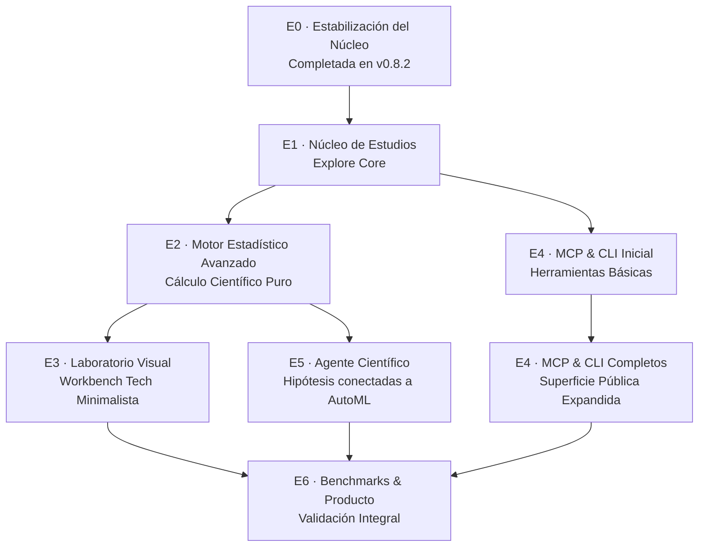

# Plan de Evolución Arquitectónica: CATML Explore

> **Documento:** Plan de Implementación por Fases (E0 a E6)  
> **Estado:** Propuesta Técnica de Evolución Aprobada  
> **Base de Código:** CATML v0.8.x / v0.9.x  
> **Estrategia:** Desarrollo Incremental, Modular y 100% Retrocompatible  
> **Especificación Asociada:** [spec.md](spec.md) · [ADR-008](../../decisions/008-catml-explore-modular-monolith.md)

---

## 1. Resumen Ejecutivo y Estrategia

El plan de evolución **CATML Explore** añade capacidades de análisis estadístico avanzado, descubrimiento empírico de patrones e integración gobernada con agentes externos (Codex, Claude Code, etc.) a través del protocolo MCP y la CLI.

La implementación se estructura como un **monolito modular con arquitectura hexagonal y CQRS**, reutilizando la infraestructura existente de CATML (persistencias SQLite, bus de comandos y consultas, sistema de trabajos `JobService`, control de acceso y gobernanza).

### Cadena de Dependencias de Fases

---

## 2. Desglose Detallado por Fases

---

### Fase E0 — Estabilización del Núcleo (Core Stabilization)

* **Estado:** **COMPLETADA** (concluida en ramas de hardening v0.8.2 / PRs #73, #74 y #75).
* **Propósito:** Eliminar cualquier defecto crítico o silencioso en el motor base antes de asentar automatización científica sobre él.

#### Trabajos Ejecutados:
1. **Normalización de Métricas:** Inversión de signo en scores de pérdida (`neg_mean_absolute_error`, `neg_root_mean_squared_error`, `neg_log_loss`) asegurando valores positivos reales ($MAE \ge 0$) y ordenamiento minimizante estricto (`ASC`) en el Leaderboard.
2. **Exclusión de Pruebas Fallidas:** Modificación del repositorio SQLite para excluir por defecto trials fallidos (`succeeded is False`), impidiendo que un score $0.0$ atribuido a un crash se corone como modelo ganador.
3. **Erradicación de Fallbacks Silenciosos:** Eliminación de sustituciones automáticas por `accuracy`/`r2` ante métricas desconocidas; levantamiento de `ValueError` explícito.
4. **Hardening de Presupuesto Temporal:** Formalización de `time_budget_seconds` como límite cooperativo global entre modelos, respetando modelos completados y marcando expiración sin abortos destructivos.
5. **Seguridad en HTTP y Servidores:** Adición de autenticación remota para el Workbench, sanitización de credenciales en URL mediante fragmentos `#token=` y advertencia de seguridad explícita en MCP Streamable-HTTP.

* **Criterio de Aceptación:** 622 tests pasando (100% verde), cobertura $\ge 87\%$, paridad CLI verificada.

---

### Fase E1 — Núcleo de Estudios (Explore Core)

* **Prioridad:** **P0 (Inmediata)**
* **Dependencia:** Fase E0.
* **Objetivo:** Establecer la base estructural del contexto `analysis` sin alterar el comportamiento de AutoML ni romper compatibilidad con workspaces existentes.

#### Trabajos:
1. **Entidades de Dominio:**
   * Crear el subpaquete puro `src/automl/domain/analysis/` conteniendo `StudySpec`, `AnalysisRun`, `StatisticalFinding`, `VisualizationSpec` y `EvidenceLink`.
   * Permitir formalmente `target_column = None` en `StudySpec`, habilitando estudios puramente descriptivos y no supervisados.
2. **Servicio de Aplicación:**
   * Crear `src/automl/application/analysis/study_service.py` (`AnalysisStudyService`).
   * Desacoplar este servicio de `AutoMLWorkspace` mediante inyección de dependencias.
3. **Esquema de Persistencia Relacional:**
   * Crear `src/automl/infrastructure/database/sqlite_studies.py` con migraciones aditivas:
     * `analysis_studies` (metadatos del estudio, referencia al dataset, parámetros).
     * `analysis_runs` (ejecución, fecha de inicio/fin, versión del paquete, semilla).
     * `analysis_findings` (hallazgos cuantitativos en formato JSON).
     * `visualization_specs` (especificaciones serializables de gráficos).
4. **Casos de Uso CQRS:**
   * Comandos: `CreateStudyCommand`, `RunAnalysisCommand`, `ArchiveStudyCommand`.
   * Consultas: `GetStudyQuery`, `ListStudiesQuery`, `GetAnalysisRunQuery`, `ListFindingsQuery`.
   * Registro en `src/automl/application/bootstrap.py`.
5. **Integración con `JobService`:**
   * Adaptar `JobWorker` para despachar trabajos de análisis exploratorio en segundo plano.
6. **Superficie Inicial CLI y MCP:**
   * Subcomando CLI básico: `catml explore create <dataset_id> [--target <col>]`.
   * Herramienta MCP básica: `analysis_create_study`, `analysis_get_study`.

* **Entregable:** Capacidad de crear un estudio sobre un dataset registrado, ejecutar un profiling descriptivo enriquecido y consultar el resultado idéntico desde Python, CLI o MCP.
* **Criterio de Aceptación:** Mismo identificador de estudio recuperable en las 3 interfaces; compatibilidad total con bases de datos `.automl/*.db` existentes.

---

### Fase E2 — Motor Estadístico Avanzado (Advanced Statistical Engine)

* **Prioridad:** **P0**
* **Dependencia:** Fase E1.
* **Objetivo:** Dotar a Explore de un motor de inferencia estadística matemática real sin depender de generación de código por LLMs.

#### Trabajos:
1. **Calidad de Datos & Diagnóstico Profundo:**
   * Detección de distribuciones (normalidad mediante Shapiro-Wilk/D'Agostino, multimodalidad, asimetría y curtosis).
   * Detección multivariante de valores atípicos (Isolation Forest, Mahalanobis Distance o IQR ponderado).
2. **Asociaciones Lineales y No Lineales:**
   * Matrices de correlación de Pearson y Spearman con matrices de p-valores ajustados.
   * Asociaciones categóricas rigurosas: Cramer's V, Theil's U (asociación asimétrica) y pruebas de Chi-cuadrado.
   * Información mutua continua/discreta estandarizada para capturar no-linealidades complejas.
3. **Pruebas de Hipótesis Automatizadas:**
   * Selección automática de pruebas según tipos y supuestos (t-test de Welch, Mann-Whitney U, Kruskal-Wallis, ANOVA con prueba de Levene).
   * Cálculo obligatorio de **tamaños del efecto** (Cohen's d, Eta al cuadrado) e intervalos de confianza del 95%.
   * Corrección por pruebas múltiples (Benjamini-Hochberg FDR o Bonferroni) para mitigar el problema del *data dredging*.
4. **Extracción Estructurada de Hallazgos:**
   * Normalización de cada resultado en un `StatisticalFinding` estructurado con advertencias de supuestos violados.
5. **Gestión de Dependencias:**
   * Encapsular `scipy` y `statsmodels` bajo el extra `catml[explore]`. Si no están presentes, degradar de forma amigable informando de la instalación del extra.

* **Criterio de Aceptación:** Resultados contrastados con datasets de prueba sintéticos con propiedades matemáticas conocidas (ej. Anscombe's Quartet, variables no lineales con correlación cero pero información mutua alta); cero llamadas a LLM para cálculos matemáticos.

---

### Fase E3 — Laboratorio Visual Interactivo (Workbench Exploration UI)

* **Prioridad:** **P1**
* **Dependencia:** Fases E1 y E2.
* **Objetivo:** Construir una interfaz visual analítica de nivel profesional en el Workbench existente (`interfaces/web/`).

#### Trabajos:
1. **Generador de Especificaciones Visuales (`VisualizationBuilder`):**
   * En `engine/analysis/visualizations/`, transformar datos agregados en objetos `VisualizationSpec` declarativos.
   * Agregación en backend: cálculo de cuantiles para boxplots, cortes de histogramas y hexbins para scatter masivos (evitando enviar millones de puntos al DOM).
2. **Componente Visual Explore (Tech Minimalista):**
   * Crear `src/automl/interfaces/web/static/js/views/explore.js`.
   * Cumplimiento estricto con [ADR-006](../../decisions/006-tech-minimalist-premium-brand-system.md): tipografía `Geist` / `Geist Mono`, bordes de 1px, paleta grafito/eléctrico, alta densidad informativa.
3. **Capacidades del Laboratorio:**
   * Selector de estudios y ejecuciones.
   * Matriz interactiva de correlaciones/asociaciones con mapa de calor monocromático sobrio.
   * Galería de hallazgos estadísticos con chips de severidad y badges de significancia estadística ($p < 0.05$).
   * Comparador bivariado con selector de segmentos y subpoblaciones.
   * Filtros dinámicos sincronizados entre vistas.
   * Exportación de estudios y gráficos a JSON/PNG.

* **Criterio de Aceptación:** El usuario puede navegar hallazgos, filtrar visualizaciones y explorar distribuciones sin ejecutar ningún entrenamiento y con renderizado fluido (< 100 ms).

---

### Fase E4 — Interoperabilidad MCP y CLI Completa (Agent Surface)

* **Prioridad:** **P0**
* **Dependencia:** Fase E1 (y E2 para herramientas analíticas completas).
* **Objetivo:** Permitir que agentes externos como Claude Code, OpenAI Codex y entornos IDE interactúen fluidamente con CATML Explore.

#### Trabajos:
1. **Ampliación del Servidor MCP (`src/automl/interfaces/mcp/`):**
   * Implementar herramientas especializadas:
     * `analysis_create_study(dataset_id, target_column=None, analysis_types=[])`
     * `analysis_get_study(study_id)`
     * `analysis_get_findings(study_id, min_significance=0.05, category=None, limit=20)`
     * `analysis_get_visualizations(study_id, chart_id=None)`
     * `analysis_propose_experiment(finding_id, hypothesis_description, transformation_spec)`
   * Recursos MCP de solo lectura: `catml://studies/{study_id}/findings`, `catml://studies/{study_id}/summary`.
2. **Optimización de Ventana de Contexto (Token Efficiency):**
   * Filtrado y paginación en `analysis_get_findings` para no saturar el prompt del LLM con datos crudos irrelevantes.
3. **Comandos CLI `catml explore`:**
   * `catml explore list`: Listado de estudios en el workspace.
   * `catml explore run <study_id>`: Ejecución de cálculo estadístico.
   * `catml explore findings <study_id> [--json]`: Extracción de hallazgos estructurados.
   * `catml explore export <study_id> -o <path>`: Reporte científico reproducible.

* **Criterio de Aceptación:** Validación de interacción real con Claude Code / Codex mediante MCP consultando un estudio y recuperando hallazgos sin errores de schema.

---

### Fase E5 — Agente Científico y Conexión con AutoML (Hypothesis Engine)

* **Prioridad:** **P1**
* **Dependencia:** Fases E2 y E4.
* **Objetivo:** Conectar el descubrimiento estadístico de patrones con la experimentación guiada en AutoML bajo el principio "Propose ≠ Accept".

#### Trabajos:
1. **Generación de Hipótesis Estructuradas:**
   * Mapeo de hallazgos estadísticos a transformaciones de Machine Learning:
     * *Asimetría extrema* $\rightarrow$ Propuesta de transformación Box-Cox / Yeo-Johnson o Log1p.
     * *Colinealidad alta ($r > 0.95$)* $\rightarrow$ Propuesta de eliminación o consolidación PCA.
     * *Información mutua alta bivariada* $\rightarrow$ Propuesta de interacción o binning.
     * *Estructura de grupos detectada* $\rightarrow$ Propuesta de validación GroupKFold para mitigar fuga de datos.
2. **Entidad `EvidenceLink`:**
   * Registro del vínculo entre `AnalysisHypothesis` y `Experiment` en AutoML.
   * Ejecución controlada con el mismo protocolo de validación cruzada y métricas que el baseline.
3. **Decisión y Cierre:**
   * Si la hipótesis produce una mejora superior al umbral configurado ($\Delta_{metric} > \epsilon$), se promueve el feature set; en caso contrario, se marca como rechazada y se preserva el registro del aprendizaje negativo.

* **Criterio de Aceptación:** Ninguna transformación se promueve sin verificación experimental previa; trazabilidad completa desde la sugerencia del agente hasta el resultado empírico.

---

### Fase E6 — Benchmarks Integrales y Preparación para Release

* **Prioridad:** **P1**
* **Dependencia:** Fases E1 a E5.
* **Objetivo:** Garantizar la precisión científica, seguridad, rendimiento y estabilidad de toda la suite.

#### Trabajos:
1. **Batería de Benchmarks en Cuatro Ejes:**
   * **Exactitud Estadística:** Pruebas contra datasets de referencia del NIST (National Institute of Standards and Technology) y datasets sintéticos calibrados.
   * **Rendimiento AutoML:** Comparativa de tiempo y calidad antes y después de aplicar sugerencias de Explore.
   * **Seguridad & Privacidad:** Verificación de aislamiento local y pruebas de prompt injection / mitigación de fugas en herramientas MCP.
   * **Regresión & Migraciones:** Pruebas de compatibilidad con bases de datos y workspaces de versiones anteriores de CATML.
2. **Documentación de Cierre y Guías de Usuario:**
   * Actualización del `DEVELOPER_GUIDE.md` y documentación de la API pública.

---

## 3. Matriz de Priorización y Entregables

| Entregable / Capacidad | Prioridad | Fase | PR Sugerida |
|---|---|---|---|
| Contratos de dominio de Explore (`domain/analysis/`) | P0 | E1 | PR 1 (Explore Domain) |
| Persistencia SQLite aditiva (`sqlite_studies.py`) | P0 | E1 | PR 2 (Studies Persistence) |
| `AnalysisStudyService` y operaciones CQRS | P0 | E1 | PR 3 (Study Application Service) |
| Motor de correlaciones y descriptiva (`scipy`) | P0 | E2 | PR 4 (Descriptive & Association Engine) |
| Pruebas de hipótesis con p-values ajustados | P0 | E2 | PR 5 (Hypothesis Testing Engine) |
| Herramientas MCP y comandos CLI `catml explore` | P0 | E4 | PR 6 (MCP & CLI Explore Tools) |
| Vista visual interactiva en el Workbench | P1 | E3 | PR 7 (Explore UI View) |
| Conexión de hipótesis con experimentos AutoML | P1 | E5 | PR 8 (Hypothesis to Experiment Link) |
| Benchmarks científicos y suite de regresión | P1 | E6 | PR 9 (Benchmarks & Hardening) |

---

## 4. Reglas Inmutables para Proteger la Integridad de CATML

1. **Migraciones Aditivas:** Nuevas tablas de estudios sin alterar las tablas `runs`, `experiments` ni `trial_results`.
2. **Aislamiento Hexagonal:** `domain/analysis/` no importa paquetes externos.
3. **Extras Opcionales:** `scipy` y `statsmodels` deben declararse en el extra `catml[explore]` para preservar la ligereza del core.
4. **Evidencia antes que IA:** CATML calcula números reales; los modelos de lenguaje solo interpretan o sintetizan.
5. **No Regresiones en la Suite:** La suite de pruebas actual (622 tests) debe mantenerse pasando al 100% con cobertura $\ge 85\%$ en cada pull request.
