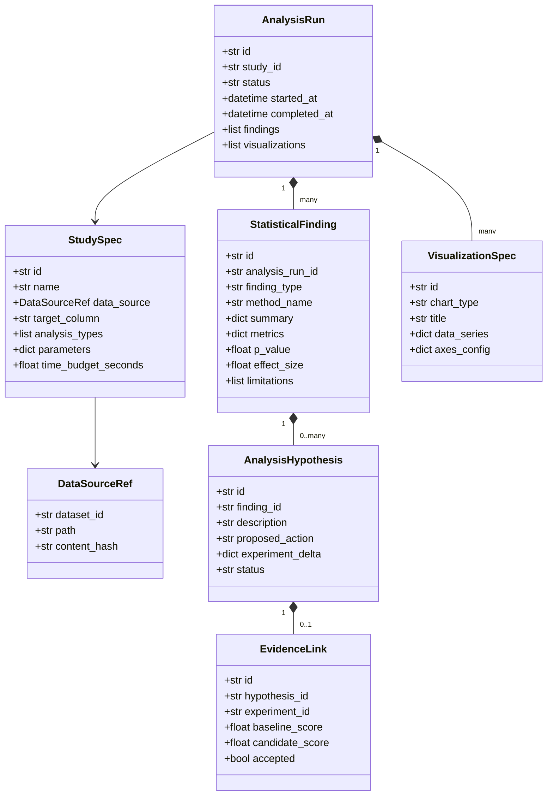

# Especificación de Funcionalidad: CATML Explore

> **Módulo:** `catml-explore`  
> **Estado:** Especificación de Arquitectura y Ampliación de Capacidades  
> **Base:** CATML v0.8.x / v0.9.x  
> **Relacionado con:** [ADR-001 (Hexagonal/CQRS)](../../decisions/001-hexagonal-architecture-and-cqrs.md), [ADR-002 (Hipótesis)](../../decisions/002-hypothesis-driven-experiments.md), [ADR-006 (Tech Minimalista)](../../decisions/006-tech-minimalist-premium-brand-system.md), [ADR-008 (Monolito Modular Explore)](../../decisions/008-catml-explore-modular-monolith.md) y [Plan Maestro](../../MASTER_PLAN.md).

---

## 1. Visión y Objetivo

**CATML Explore** amplía la plataforma CATML transformándola de un motor de AutoML tabular en un **laboratorio integrado de análisis estadístico científico, descubrimiento de evidencia e inferencia de hipótesis gobernadas**.

El objetivo es proporcionar un subsistema de análisis riguroso y determinista que:
1. Opere sobre datasets con o sin columna objetivo predictiva (`target`).
2. Genere hallazgos estructurados (`StatisticalFinding`) con evidencia matemática verificable (p-values, intervalos de confianza, matrices de asociación, detección de valores atípicos y distribuciones), eliminando la alucinación de LLMs.
3. Conecte de forma transparente los hallazgos exploratorios con propuestas de experimentos de AutoML bajo el principio inmutable **"Propose ≠ Accept"**.
4. Exponga las capacidades con paridad estricta entre la biblioteca Python, la CLI (`catml explore`), el Workbench interactivo (Tech Minimalista) y servidores MCP para agentes externos (Codex, Claude Code, etc.).

---

## 2. Principios de Diseño Arquitectónico

1. **Monolito Modular con Separación Hexagonal Estricta:**
   * Explore no es un microservicio ni un producto separado; reside dentro del árbol de CATML compartiendo infraestructura de persistencia SQLite, sistema de trabajos en segundo plano (`JobService`), autenticación y registro de datasets.
   * `domain/analysis/` permanece libre de dependencias estadísticas o de manipulación de datos (cero `pandas`, `scipy`, `statsmodels`).
2. **"La IA Interpreta, CATML Calcula" (Evidencia antes que IA):**
   * Ningún agente externo (LLM) calcula números o inventa asociaciones; el motor de cálculo estadístico (`engine/analysis/`) ejecuta algoritmos deterministas y emite hallazgos estructurados. El agente consume estos hallazgos para formular hipótesis.
3. **Paridad Total de Interfaces:**
   * Cualquier estudio que pueda ejecutarse desde el Workbench visual debe poder ser invocado de forma idéntica desde `catml explore` (CLI) o `analysis_create_study` (MCP), mediante `CommandBus` y `QueryBus`.
4. **Visualización Declarativa (`VisualizationSpec`):**
   * El frontend no ejecuta lógica analítica ni agregaciones pesadas. El backend emite especificaciones declarativas serializables en JSON (quantiles, bins de histogramas, hexbins) que el cliente web simplemente renderiza.
5. **Privacidad y Procesamiento Local:**
   * Todos los cálculos estadísticos y análisis se ejecutan dentro del entorno local del usuario sin salida no autorizada de datos hacia APIs externas.

---

## 3. Modelo de Dominio (`src/automl/domain/analysis/`)



### Definición de Entidades

* **`DataSourceRef`:** Referencia inmutable a un dataset registrado, ruta de archivo o partición, identificada con digest SHA-256 para trazabilidad y reproducibilidad.
* **`StudySpec`:** Especificación declarativa de un estudio exploratorio. El campo `target_column: str | None = None` es opcional, habilitando formalmente estudios no supervisados o puramente descriptivos.
* **`AnalysisRun`:** Registro de ejecución reproducible de un estudio (análogo a `AutoMLRun`), conteniendo semillas, entorno, versión del software y estado del ciclo de vida.
* **`StatisticalFinding`:** Hecho estadístico verificado (ej. asimetría severa, colinealidad bivariada, relación no lineal mediante información mutua, separación clusterizada o anomalías multivariantes). Incluye el método exacto, métricas cuantitativas, valor p, tamaño del efecto y supuestos violados/limitaciones.
* **`VisualizationSpec`:** Estructura JSON pura que codifica el tipo de gráfico (`histogram`, `boxplot`, `scatter`, `correlation_matrix`, `segment_bar`), ejes, cuantiles y puntos de control.
* **`AnalysisHypothesis`:** Hipótesis de mejora para Machine Learning generada a partir de un hallazgo (ej. "Aplicar transformación logarítmica sobre variable sesgada", "Excluir característica colineal", "Crear feature cruzada").
* **`EvidenceLink`:** Vínculo de verificación empírica entre una hipótesis y el resultado de un experimento en AutoML (comprobando si la propuesta mejoró o no la métrica primaria).

---

## 4. Arquitectura y Responsabilidades por Capa

| Capa | Ubicación Propuesta | Responsabilidad |
|---|---|---|
| **Dominio** | `src/automl/domain/analysis/` | Entidades puras (`StudySpec`, `StatisticalFinding`, etc.), protocolos (`StatisticalEnginePort`, `StudyRepositoryPort`) y tipos de valor. Sin dependencias externas. |
| **Aplicación** | `src/automl/application/analysis/` | `AnalysisService`, Comandos (`CreateStudyCommand`, `RunAnalysisCommand`), Consultas (`GetStudyQuery`, `ListFindingsQuery`, `GetVisualizationsQuery`) y orquestación con `JobService`. |
| **Motor** | `src/automl/engine/analysis/` | Algoritmos estadísticos (`DescriptiveAnalyzer`, `AssociationEngine`, `HypothesisTestingEngine`, `AnomalyDetector`, `VisualizationBuilder`). Usa `scipy` y `statsmodels` encapsulados. |
| **Infraestructura** | `src/automl/infrastructure/database/sqlite_studies.py` | Implementación de persistencia relacional aditiva sobre SQLite (`analysis_studies`, `analysis_runs`, `analysis_findings`, `visualization_specs`, `evidence_links`). |
| **Interfaces (CLI)** | `src/automl/interfaces/cli/explore_cli.py` | Comandos `catml explore create`, `catml explore run`, `catml explore findings`, `catml explore show`. Salida interactiva o JSON formateado. |
| **Interfaces (MCP)** | `src/automl/interfaces/mcp/analysis_tools.py` | Tools MCP: `analysis_create_study`, `analysis_get_findings`, `analysis_get_visualizations`, `analysis_propose_experiment`. |
| **Interfaces (Web)** | `src/automl/interfaces/web/static/js/views/explore.js` | Vista dedicada en el Workbench: galería de hallazgos, filtros dinámicos, matrices de asociación y renderizado Tech Minimalista. |

---

## 5. Paridad de Interfaces y Flujo de Interacción

```text
       ┌──────────────┐     ┌──────────────┐     ┌──────────────┐
       │     CLI      │     │  Workbench   │     │ MCP (Agente) │
       │ catml explore│     │  UI Explore  │     │ Claude/Codex │
       └──────┬───────┘     └──────┬───────┘     └──────┬───────┘
              │                    │                    │
              ▼                    ▼                    ▼
     ┌────────────────────────────────────────────────────────┐
     │       CommandBus / QueryBus (Capa de Aplicación)       │
     │   CreateStudyCommand, RunAnalysisCommand, Queries...   │
     └────────────────────────────┬───────────────────────────┘
                                  │
                                  ▼
                     ┌─────────────────────────┐
                     │     AnalysisService     │
                     └────────────┬────────────┘
                                  │
                     ┌────────────┴────────────┐
                     ▼                         ▼
          ┌─────────────────────┐   ┌─────────────────────┐
          │   SQLite Studies    │   │ Statistical Engine  │
          │    Persistencia     │   │  Cálculo Numérico   │
          └─────────────────────┘   └─────────────────────┘
```

---

## 6. Integración con AutoML ("Propose ≠ Accept")

El flujo de cierre entre CATML Explore y CATML AutoML obedece a un protocolo de verificación experimental estricto:

1. **Detección:** El motor estadístico detecta una relación no lineal fuerte entre `x1` y `y` mediante información mutua ($MI = 0.65, p < 0.001$).
2. **Propuesta:** Se registra un `StatisticalFinding` y se formula una `AnalysisHypothesis` (propuesta de transformación spline o interacción).
3. **Validación:** Un agente o el usuario aprueba la hipótesis, generando un `CreateExperimentCommand` en AutoML con el feature set modificado.
4. **Verificación:** AutoML entrena el modelo candidato y el baseline en el mismo split y métrica.
5. **Cierre:** Si el candidato supera al baseline, se marca `EvidenceLink.accepted = True` y la transformación se promueve; en caso contrario, se rechaza y se archiva el aprendizaje sin degradar el modelo de producción.
