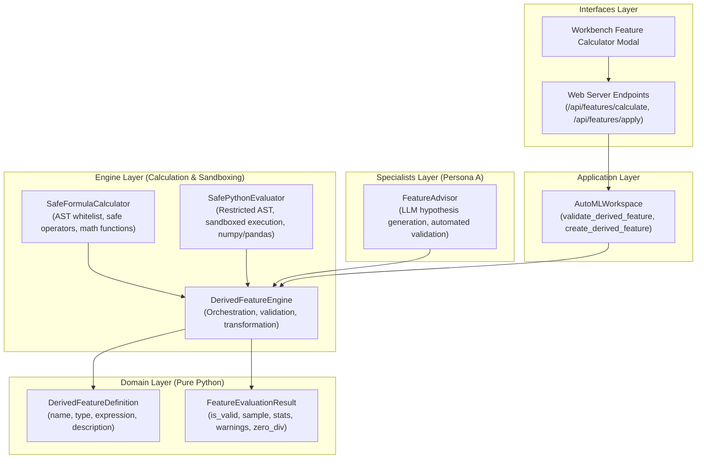

# Feature Specification: Safe Feature Calculator & Derived Column Engine

**Status:** Approved  
**Milestone:** H4 Extension (Persona A — Domain & Specialists)  
**Author:** Persona A  
**Related ADRs:** `docs/decisions/005-neo-industrial-visual-ml-lab-ui.md`

---

## 1. Executive Summary

CATML provides automated feature generation (such as pairwise ratios, products, differences, and target encoding in `InteractionFeatureGenerator`). However, domain experts and autonomous LLM agents frequently need to formulate custom, problem-specific derived columns (e.g. financial leverage ratios, medical body mass indices, log transformations, or conditional risk thresholds).

This feature introduces the **Safe Feature Calculator & Derived Column Engine**:
1. **Dual Execution Modes**:
   - **Formula / Calculator Mode**: Intuitive domain-specific syntax (`income / (debt + 1e-5)`, `log1p(sales)`, `clip(age, 18, 90)`, `if_else(score > 50, 1, 0)`).
   - **Safe Python Code Mode**: Restricted Python functions (`def compute_feature(df): ...` or `lambda df: ...`).
2. **Rock-Solid Robustness**:
   - **Division by Zero Protection**: Automatic zero-denominator insulation with epsilon, NaN/Inf replacement, and tracking.
   - **Strict Type Checking**: Verification of referenced columns, data types, and output array shapes.
   - **Sandboxing & Security**: AST validation strictly banning dangerous operations (`import`, `open`, `exec`, `eval`, `subprocess`, `os`, `sys`, file/network access).
3. **Autonomous LLM Connectivity**:
   - `FeatureAdvisor` specialist enables LLMs to inspect dataset profiles, propose domain-informed feature hypotheses, validate them deterministically, and reject invalid or constant columns before training.
4. **Interactive Workbench UI & REST API**:
   - REST API endpoints for validation preview (`POST /api/features/calculate`) and creation (`POST /api/features/apply`).
   - Interactive visual calculator in the web interface with column chips, operator buttons, live preview, and statistical diagnostic cards.

---

## 2. Hexagonal Architecture & Isolation

Following Rule 1 and Rule 9 in `AGENTS.md`:

---

## 3. Sandboxing & Safety Guarantees

### 3.1 AST Security Whitelist
The formula calculator only allows the following AST nodes:
- Expressions: `Expression`, `BinOp`, `UnaryOp`, `Compare`, `BoolOp`, `Call`, `Name`, `Constant`, `IfExp`.
- All imports, assignments, loops, statements, and attribute access to private/dunder members are strictly rejected.

### 3.2 Python Code Restrictions
- Restricted `__builtins__`: No `open`, `exec`, `eval`, `compile`, `getattr`, `setattr`, `__import__`, `globals`, `locals`.
- Execution context restricted to `np` (NumPy) and `pd` (Pandas).
- Enforces function signature returning 1D array/Series of matching row length.

### 3.3 Zero-Division & Edge-Case Protection
- Any `/` or `//` operation evaluates denominator; where `denom == 0`, denominator is safely shielded and replaced, preventing program crashes.
- Any resulting `inf`, `-inf`, or `nan` is sanitized via `np.nan_to_num` with configurable bounding.
- Negative values passed to `sqrt`, `log`, or `log1p` are clipped to valid domains.
- Warnings are emitted if:
  - The generated column has 0 variance (constant value).
  - More than 20% of values are `NaN`.
  - Division by zero occurred during computation.

---

## 4. Verification & Testing Strategy

- Unit tests for AST formula parsing, operator evaluation, and math functions.
- Unit tests for zero-division protection and edge cases (empty strings, strings as inputs, mismatched lengths, negative sqrts).
- Security unit tests attempting malicious code injection (`os.system`, `__import__`, file reads) ensuring 100% rejection.
- Unit tests for `FeatureAdvisor` with heuristic and LLM fallback.
- Integration tests with `AutoMLWorkspace` and Web API HTTP endpoints.
- Total coverage requirement: >= 85%.
