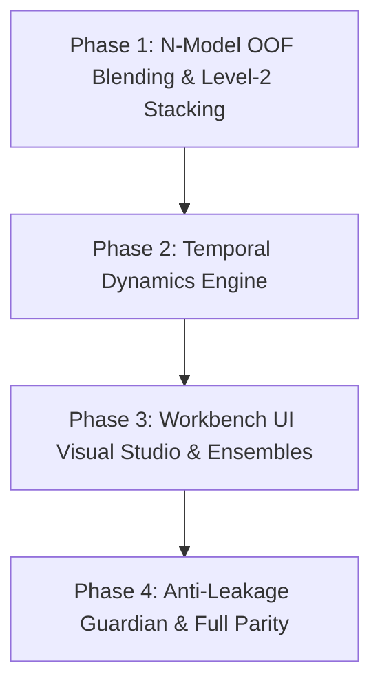

# Implementation Plan: Generalist AutoML Engine, Temporal Dynamics & Super-Ensembles

> Reference: See technical specification in [`spec.md`](spec.md).  
> Tracking: Backlog and milestones synchronized with [`TASKS.md`](../../../TASKS.md).

---

## 1. Modular Phase Breakdown

---

### Phase 1: Generalized $N$-Model OOF Blending & Level-2 Stacking

**Objective:** Remove the 2-model restriction in out-of-fold blending, integrate native rank-averaging in OOF commands, and implement Level-2 Stacking with regularized meta-estimators.

- [ ] **Engine — OOF Generalization (`src/automl/engine/ensemble/oof.py`):**
  - Remove `if len(factories) > 2:` check; allow $N \ge 1$ arbitrary model factories.
  - Support `method="rank"` and `method="simplex"` in `evaluate_oof`.
- [ ] **Engine — Stacking Blender (`src/automl/engine/ensemble/blender.py`):**
  - Implement `stack_predictions(oof_predictions, y_true, test_predictions, meta_model="ridge")`.
  - Train Level-2 `RidgeClassifier` / `Ridge` meta-model on OOF prediction matrix without data leakage.
- [ ] **Application Layer — Service & Commands (`src/automl/application/services/oof_submission.py`):**
  - Update `GenerateOOFSubmissionCommand` to accept arbitrary `model_ids: list[str]`.
  - Add `method: str = "average" | "rank" | "simplex" | "stacked"`.
  - Persist multi-model artifact reports and hashes in `report.json`.
- [ ] **Interfaces — CLI Parity (`src/automl/interfaces/cli/main.py`):**
  - Update `automl predict` to accept comma-separated $N$ models (e.g. `--models lgbm,xgb,catboost,logistic_regression,extra_trees`).
  - Add `--method {average,rank,simplex,stacked}` flag.
- [ ] **Testing:**
  - `tests/test_oof_multi_model.py`: Verify 3+ models blending, rank averaging, stacking meta-model, parameter isolation, and artifact reproducibility.

---

### Phase 2: Temporal Dynamics Engine (Lags, Deltas & Cycles)

**Objective:** Discover and generate time-series lag and delta features automatically from sequential or chronological tabular data without manual feature scripts.

- [ ] **Domain — Contracts (`src/automl/domain/features/temporal.py`):**
  - Pure Python dataclasses: `TemporalPeriodicity`, `LagSpec`, `RollingWindowSpec`.
- [ ] **Engine — Temporal Profiling (`src/automl/engine/profiling/dataset_profiler.py`):**
  - Add `detect_sequential_structure(df)` checking date formats, continuous integer sequences, and cyclic day/month/hour ranges.
  - Report `is_sequential: bool`, `detected_periodicity: float | None`, `temporal_columns: list[str]`.
- [ ] **Engine — Feature Generator (`src/automl/engine/features/generation/temporal_generator.py`):**
  - Implement `TemporalDynamicsGenerator`:
    - Generates $X_{t-k}$ lags and $\Delta X = X_t - X_{t-k}$ deltas.
    - Generates $\sin(2\pi \cdot t / T)$ and $\cos(2\pi \cdot t / T)$ for detected cycles.
    - Proposes candidate `FeatureSet` instances (`interactions_temporal_deltas`, `interactions_temporal_lags`).
  - Strict non-mutation of input dataframes; transformation preserves past-only ordering on test sets.
- [ ] **Application Layer — CQRS Commands:**
  - Register `GenerateTemporalFeaturesCommand` in `bootstrap.py`.
- [ ] **Testing:**
  - `tests/test_temporal_dynamics.py`: Test lag accuracy, delta computation, test set alignment, and immutability.

---

### Phase 3: Workbench Web UX (Visual Studio & 1-Click Ensembling)

**Objective:** Bring complete parity and effortless experimentation to the Neo-Industrial Web Dashboard (`automl ui`).

- [ ] **Validation Strategy Selector in New Experiment Modal (`new_experiment.js`):**
  - Radio/dropdown options: `Holdout (80/20)`, `5-Fold Stratified CV`, `10-Fold Stratified CV`.
  - Pass `validation_strategy` and `cv_folds` to `POST /api/experiments`.
- [ ] **Visual Multi-Model Ensemble Builder (`studio.js` & `overview.js`):**
  - Checkboxes next to trials on the Leaderboard table.
  - Primary Neo-Industrial action button (`#E5512D`): `[🔨 Assemble Selected Models]`.
  - Modal to configure blending method (`Rank-Averaging`, `Nelder-Mead Simplex`, `Ridge Stacking`).
  - Submits job asynchronously to SQLite queue; worker executes in background with live progress streaming.
- [ ] **Kaggle Submission Export Center (`kaggle.js`):**
  - Drag-and-drop or file selector for `test.csv` and `sample_submission.csv`.
  - Direct download button for evaluated submission CSVs.
- [ ] **Testing:**
  - `tests/test_web_dashboard.py`: Add test cases for multi-select ensemble creation, $K$-fold validation configuration, and submission generation endpoints.

---

### Phase 4: Anti-Leakage Guardian & Capability Observability

**Objective:** Prevent catastrophic silent data leakage and provide clear runtime visibility of model backends.

- [ ] **Anti-Leakage Diagnostic in `DatasetProfiler`:**
  - Detect perfect correlation ($|r| \ge 0.999$) between any feature and target.
  - Detect sequential leakage where target values correlate monotonically with row IDs.
  - Expose warning badge in `DatasetProfile` DTO and Web UI Dataset Inspector.
- [ ] **Plugin Capability Observability:**
  - Differentiate native packages from fallbacks in `ListPluginsQuery`:
    - e.g., `catboost (Native)` vs `catboost (Fallback: HistGradientBoosting)`.
- [ ] **Full Regression & E2E Validation:**
  - Execute full test suite: `.venv/bin/pytest --cov=src/automl --cov-fail-under=85`.
  - Verify complete CLI and Web parity.

---

## 2. Acceptance Criteria & Quality Gates

1. **Hexagonal Purity:** Cero external framework dependencies in `src/automl/domain/`.
2. **CQRS Strictness:** All mutating commands return IDs/void; queries read DTOs without side effects.
3. **Parity Principle:** Every capability accessible via Web UI must be fully executable via CLI commands and future agent tools.
4. **Test Coverage:** Global test coverage must remain $\ge 85\%$ across all modules.
5. **No Regressions:** All existing 296 unit/integration tests must continue passing.
