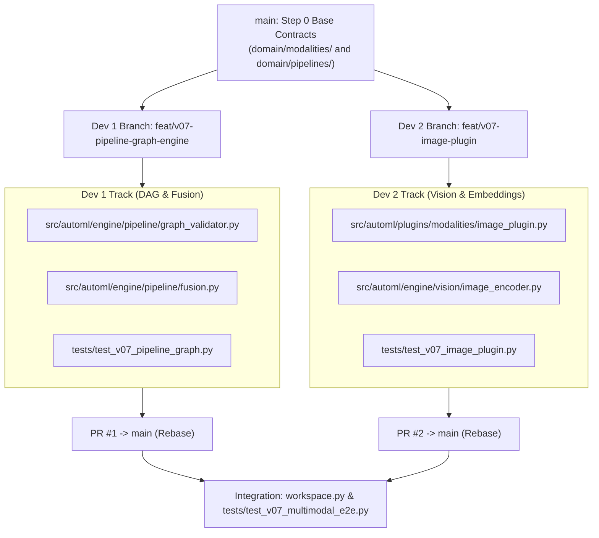

# Implementation Plan: V0.7 Multimodal Pipelines & Parallel Team Division

> Plan histórico de la fase implementada. La secuencia y asignaciones originales se conservan como referencia; no constituyen trabajo pendiente. Estado operativo: [TASKS.md](../../../TASKS.md).

> Step-by-step roadmap and zero-conflict Git division for two developers working concurrently on Phase V0.7.

---

## 1. Parallel Architecture Overview

To eliminate merge conflicts and dependencies:
- **Contract-First Base (Step 0):** Both developers branch from a common commit on `main` containing the pure domain contracts (`Modality`, `DataSource`, `PipelineGraph`, `ModalityPluginPort`).
- **Independent Layers:** 
  - **Dev 1** builds the Graph Engine & Fusion in `src/automl/engine/pipeline/`.
  - **Dev 2** builds the Vision Plugin & Image Encoder in `src/automl/plugins/modalities/` and `src/automl/engine/vision/`.
- **Zero Shared Files:** Neither developer edits the other's files or test suites.



---

## 2. Developer Assignments

### Track 1 (Dev 1): DAG Engine, Graph Validator & Feature Fusion
* **Git Branch:** `feat/v07-pipeline-graph-engine`
* **Owned Files:**
  - `src/automl/engine/pipeline/graph_validator.py`
  - `src/automl/engine/pipeline/fusion.py`
  - `tests/test_v07_pipeline_graph.py`
* **Tasks:**
  1. Implement `GraphValidator`:
     - Detect direct cycles and indirect loops (raise `ValueError` with clear cycle path).
     - Check topological ordering (`get_execution_order()`).
     - Validate type compatibility across edges (output modality matches input modality).
  2. Implement `FeatureFusionNode`:
     - Accept tabular `pd.DataFrame` and numerical embedding `np.ndarray`.
     - Align indexes and horizontally concatenate into a single numeric feature matrix.
  3. Author unit tests covering DAG acyclic verification, cycle rejection, and fusion array integrity.
* **Verification Command:**
  ```bash
  .venv/bin/pytest tests/test_v07_pipeline_graph.py
  ```

---

### Track 2 (Dev 2): Image Modality Plugin & Image Encoder
* **Git Branch:** `feat/v07-image-plugin`
* **Owned Files:**
  - `src/automl/plugins/modalities/image_plugin.py`
  - `src/automl/engine/vision/image_encoder.py`
  - `tests/test_v07_image_plugin.py`
* **Tasks:**
  1. Implement `ImageModalityPlugin`:
     - Satisfy `PluginPort` and `ModalityPluginPort`.
     - Declare capabilities: `supported_modalities=[Modality.IMAGE]`.
     - Validate image paths and supported formats (`.png`, `.jpg`, `.jpeg`).
  2. Implement `ImageEncoderNode`:
     - Transform a collection of image paths into a 2D float array of embeddings $(N, D)$.
     - Provide deterministic built-in lightweight encoder (or mock fallback) for fast unit testing.
  3. Author unit tests covering image validation, embedding dimensionality, and batch encoding.
* **Verification Command:**
  ```bash
  .venv/bin/pytest tests/test_v07_image_plugin.py
  ```

---

## 3. Execution Sequence

| Phase | Responsibility | Scope |
| :--- | :--- | :--- |
| **Step 0** | Lead / Shared | Commit pure domain abstractions to `main`: `Modality`, `DataSource`, `PipelineNode`, `PipelineGraph`, and `ModalityPluginPort`. |
| **Step 1** | Dev 1 & Dev 2 | Create respective branches and implement assigned classes and dedicated unit tests. |
| **Step 2** | Both | Rebase with `main` (`git fetch && git rebase origin/main`) and open Pull Requests. |
| **Step 3** | Integration | Connect both modules in `workspace.py` and register handlers in `bootstrap.py`. Validate with `tests/test_v07_multimodal_e2e.py`. |

---

## 4. Verification & Quality Gates

- Every branch must pass its dedicated test file:
  - Dev 1: `.venv/bin/pytest tests/test_v07_pipeline_graph.py`
  - Dev 2: `.venv/bin/pytest tests/test_v07_image_plugin.py`
- Whole test suite before merging: `.venv/bin/pytest --cov=src/automl --cov-fail-under=85` (entire current suite passing, coverage $\ge 85\%$).
