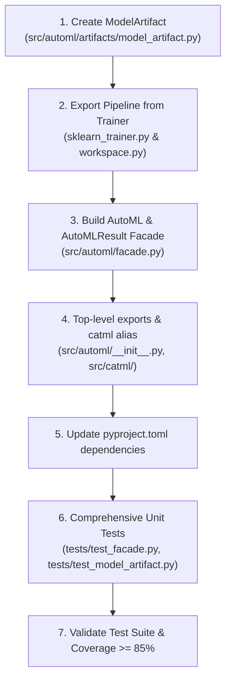

# Implementation Plan: Ergonomic AutoML Facade & Standalone Model Artifacts

> **Feature:** Productization Facade & Artifacts • **Date:** 2026-10-02  
> **Companion Spec:** [`spec.md`](spec.md)

---

## 1. Implementation Steps

---

## 2. Affected Modules & Detailed Tasks

### Step 1: `src/automl/artifacts/model_artifact.py`
- Define `ModelArtifact` dataclass:
  - `pipeline: Any` (scikit-learn Pipeline)
  - `model_id: str`
  - `task_type: str`
  - `feature_names: list[str]`
  - `target_name: str | None`
  - `metric: str`
  - `score: float`
  - `parameters: dict[str, Any]`
- Implement `save(path: str | Path)` using `joblib.dump(self, path)`.
- Implement `@classmethod load(path: str | Path) -> ModelArtifact` using `joblib.load(path)`.
- Implement `predict(X)` and `predict_proba(X)` with proper input conversion (DataFrame alignment or ndarray mapping).

### Step 2: Trainer / Workspace Pipeline Extraction
- Add `train_and_export_artifact(...) -> ModelArtifact` in `AutoMLWorkspace`:
  - Retrieves winning experiment and trial parameters.
  - Fits final pipeline on entire dataset `X, y`.
  - Returns fully self-contained `ModelArtifact`.

### Step 3: `src/automl/facade.py`
- Implement `AutoML` class:
  - Supports `fit(data, target=...)` and `fit(X, y)`.
  - Handles automatic task inference (e.g. string/object or low unique integer count $\rightarrow$ classification; continuous float $\rightarrow$ regression).
  - Creates ephemeral or persistent `AutoMLWorkspace`.
  - Executes task planning, experiment scheduling, and trial evaluation.
  - Constructs `AutoMLResult`.
- Implement `AutoMLResult` class:
  - Wraps leaderboard table into pandas DataFrame.
  - Exposes `best_model`, `best_score`, `predict()`, `predict_proba()`.

### Step 4: Top-Level Exports & `catml` Alias
- In `src/automl/__init__.py`:
  - Expose `AutoML`, `AutoMLResult`, `ModelArtifact`.
- Create `src/catml/__init__.py`:
  - Re-export `AutoML`, `AutoMLResult`, `ModelArtifact` and platform version.
- In `pyproject.toml`:
  - Ensure `src/catml` is recognized as a package.
  - Add `joblib>=1.3` to dependencies.

### Step 5: Verification & Testing
- Unit tests:
  - `tests/test_model_artifact.py`: Test saving, loading, predicting with ndarray and DataFrame, independent inference in clean process.
  - `tests/test_facade.py`: Test `AutoML.fit(df, target="churn")`, `AutoML.fit(X, y)`, classification and regression, leaderboard generation, `save()` and `load()`.
- Run full test suite with coverage check: `.venv/bin/pytest --cov=src/automl --cov-fail-under=85`.
